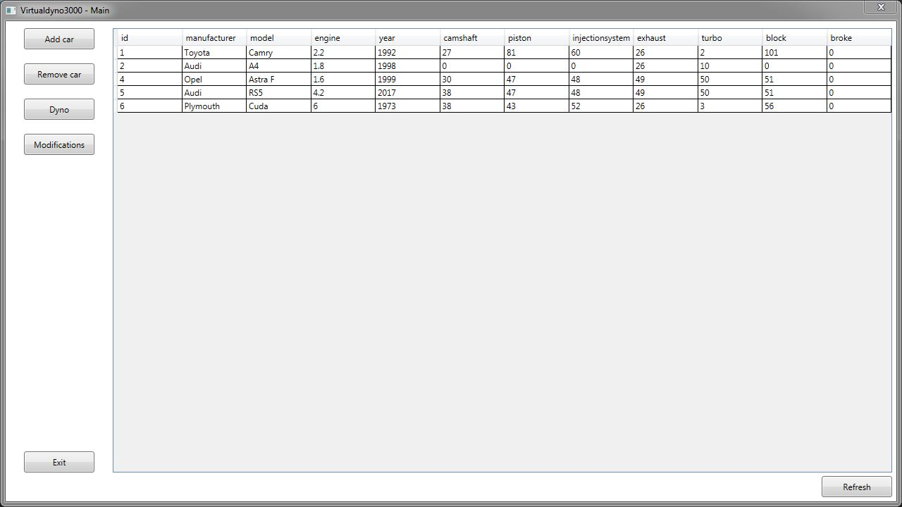
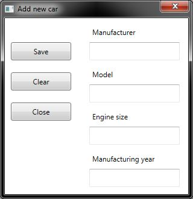
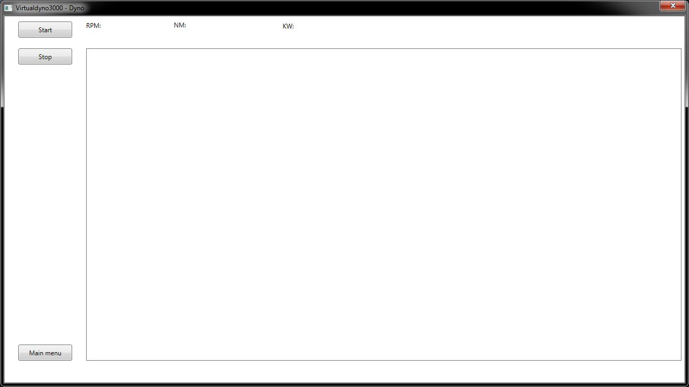
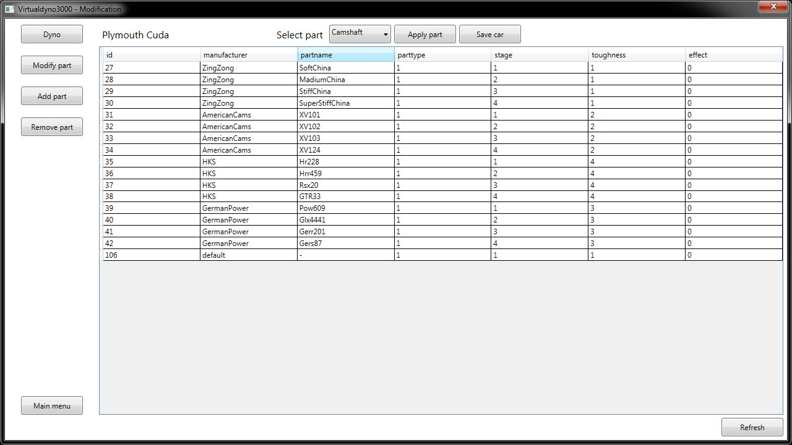
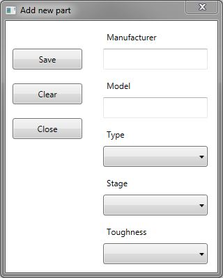
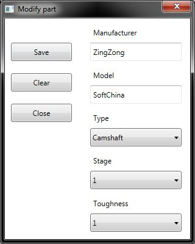

## Ohjelmoinnin harjoitustyö - Virtualdyno3000

### Ohjelma

Virtualdyno3000:lla voidaan kasata autojen kokoonpanoja eri osista ja testata niitä virtuaalidynolla. Ohjelman alkuperäinen suunnitelma löytyy [suunnitelma.md](suunnitelma.md) -tiedostosta.

#### Toteutuneet toiminnot

* Kokoonpanon kasaaminen valittavissa olevista osista
* Kasatun kokoonpanon testaaminen
* Grafiikan piirtäminen testituloksen mukaan
* Osien lisääminen, muokkaaminen ja poistaminen
* Autojen lisääminen ja poistaminen

#### Toteutumattomat toiminnot

* Kokoonpanojen ja testitulosten tallentaminen tietokantaan
* Autojen hajoaminen dynossa

#### Käyttöohje/käyttöliittymä

#####  Pääikkuna

Pääikkunassa on nähtävillä kaikki ohjelmaan lisätyt autot ja ikkunasta pääsee käsiksi ohjelman toimintoihin.

#####  Auton lisääminen

Auton lisäämis -ikkunasta voidaan lisätä ohjelmaan uusia autoja. 

#####  Dyno

Dynolla tehdään itse auton testaaminen. Testissä valittun auton tehon mukaan piirretään käyrä ja annetaan muita tietoja auton tehosta. Tähän ikkunaan pääsee valitsemalla auton pääikkunasta ja painamalla Dyno-nappia.

#####  Auton modifikointi

Auton modifikointi -ikkunassa voidaan vaihtaa auton osia. Tähän ikkunaan pääsee valitsemalla auton pääikkunasta ja painamalla Modifications-nappia.

#####  Osan lisääminen

Osien lisäämis -ikkunassa voidaan lisätä uusi osia ohjelmaan.

#####  Osan muokkaaminen

Osan muokkaamis -ikkunassa voidaan muokata osien tietoja. Tähän ikkunaan pääsee valitsemalla osan auton modifikointi -ikkunasta ja painamalla Modify part -nappia.

### Tietokanta

Auto-taulu

Osa-taulu

![)(Images/tuningtable.png)

### Ongelmat ja bugit

* Ohjelma on todettu toimivaksi vain Windows 7 ja -10 -käyttöjärjestelmillä.
* Ohjelman käyttöä varten täytyy olla joko JAMK Labranetin verkossa tai sinne on oltava VPN-yhteys Labranetin verkossa sijaitsevan tietokannan vuoksi
* Tietokannan salasana on poistettu, jotta repositoria saatiin julkiseksi. Tästä johtuen ohjelma ei toimi ilman muokkauksia koodiin

### Mitä opittiin

Opimme, että projektia tehdessä ei kannata lähteä sokeasti koodaamaan, vaan pitäisi ensin suunnitella. Opimme myös WPF-kirjaston ja Gitin käyttöä sekä ryhmässä koodaamista.

### Vastuiden ja työmäärän jakautuminen

| Tekijä                                                     | Vastuu                                                                   |
| ---------------------------------------------------------- | ------------------------------------------------------------------------ |
| [Matti Aho](https://github.com/matti644), K9251            | Tietokantayhteys, Dynon logiikka, testigrafiikka                         |
| [Niklas Hietaranta](https://github.com/niklashieta), K9279 | Testigrafiikka                                                           |
| [Atte Pekkarinen](https://github.com/attepee), L5566       | Dokumentaatio, ikkunat                                                   |

### Arvosanaehdotus

Ehdotamme arvosanaa 3.