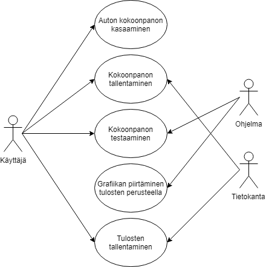

## Ohjelmoinnin harjoitustyö - Virtualdyno3000

### Sovelluksen yleiskuvaus

Auto aiheinen sovellus, jolla voidaan koota auton kokoonpano valittavissa olevista osista ja testata kokoonpanon teho.

#### Kohdeyleisö

Autoista ja niiden tuunaamisesta kiinnostuneet.

#### Käyttöympäristö ja teknologiat

Sovellus on tarkoitettu käytettäväksi Windows-käyttöjärjestelmällä. Sovelluksen toteutukseen käytetään C#-kieltä ja WPF-kirjastoa. Tarvittavan tiedon tallentamiseen käytetään Labranetin palvelimilla sijaitsevaa MySQL-tietokantaa.

#### Toiminnot

* Kokoonpanon kasaaminen valittavissa olevista osista
* Kasatun kokoonpanon testaaminen
* Grafiikan piirtäminen testituloksen mukaan
* Kokoonpanojen ja testitulosten tallentaminen tietokantaan

#### Käsitemalli

### Tekijät ja työnjako

| Tekijä                                              | Vastuu                                      |
| --------------------------------------------------- | ------------------------------------------- |
| [Matti Aho](https://github.com/matti644)            | Tietokantayhteys, ModWindow, Dynon logiikka |
| [Niklas Hietaranta](https://github.com/niklashieta) | Testigrafiikka, DynoWindow                  |
| [Atte Pekkarinen](https://github.com/attepee)       | Dokumentaatio, MainWindow, NewPartWindow    |

#### Työaikasuunnitelma

| Työn osa | Valmis |
| - | - |
| Suunnitelma | 8.4. |
| Ikkunat | Ennen 24.4. |
| Harjoitustyö | 25.4. |
