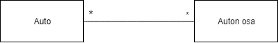

## Ohjelmoinnin harjoitustyö - Virtualdyno3000

### Ohjelma

Virtualdyno3000:lla voidaan kasata autojen kokoonpanoja eri osista ja testata niitä virtuaalidynolla.

#### Kohdeyleisö

Ohjelman kohdeyleisönä on autoista ja niiden tuunaamisesta kiinnostuneet.

#### Käyttöympäristö ja teknologiat

Sovellus on tarkoitettu käytettäväksi Windows-käyttöjärjestelmällä. Sovelluksen toteutukseen käytetään C#-kieltä ja WPF-kirjastoa. Tarvittavan tiedon tallentamiseen käytetään Labranetin palvelimilla sijaitsevaa MySQL-tietokantaa.

#### Toiminnot

* Autojen lisääminen
* Kokoonpanon kasaaminen valittavissa olevista osista
* Kasatun kokoonpanon testaaminen
* Grafiikan piirtäminen testituloksen mukaan
* Kokoonpanojen ja testitulosten tallentaminen tietokantaan

#### Käsitemalli

### Tekijät ja työnjako

| Tekijä                                              | Vastuu                                      |
| --------------------------------------------------- | ------------------------------------------- |
| [Matti Aho](https://github.com/matti644)            | Tietokantayhteys, ModWindow, Dynon logiikka |
| [Niklas Hietaranta](https://github.com/niklashieta) | Testigrafiikka, DynoWindow                  |
| [Atte Pekkarinen](https://github.com/attepee)       | Dokumentaatio, MainWindow                   |

#### Työaikasuunnitelma

| Työn osa     | Valmis |
| --------     | ------ |
| Suunnitelma  | 8.4.   |
| Ikkunat      | 25.4.  |
| Dyno         | 25.4.  |
| Harjoitustyö | 26.4.  |
